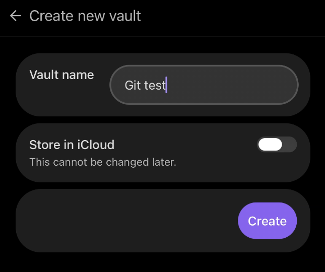
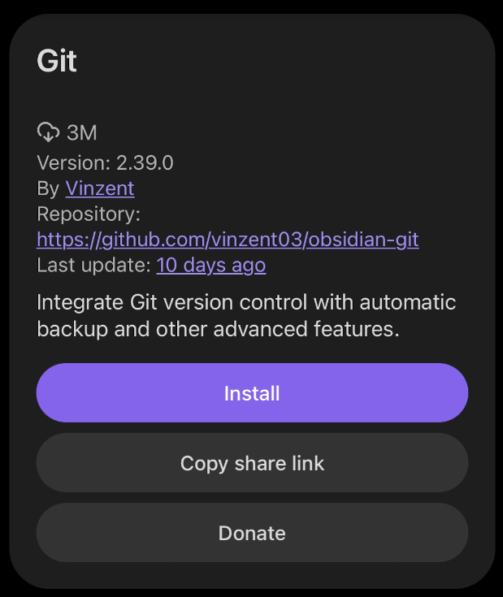

In [the previous guide](/en/guides/obsidian-github-ai-notes/) I put my Obsidian vault on GitHub. I promised to write up the mobile setup separately, and this is that write-up.

The short version: on an iPhone, the Git plugin alone handles pull, edits, commits, and pushes. I set mine up back in February, forgot about it, and the phone has been picking up the latest vault every day since. It keeps working after you stop thinking about it.

## Your phone runs a different git

On desktop, the [Git plugin](https://github.com/Vinzent03/obsidian-git) calls whatever git you have installed. An iPhone has no git to call, so on mobile the plugin switches to isomorphic-git, a JavaScript reimplementation. The author warns in the README that mobile is unstable, and SSH doesn't work there. Authentication is HTTPS with a token, and that's the only option.

The warnings sound like a reason to give up. My vault is 25MB with 319 markdown files, and at that size I've never felt the problem.

## The setup

You don't need iSH, Working Copy, or any other companion app. The plugin does everything.

1. **Create a token.** On GitHub, generate a fine-grained personal access token. Repository access: just your vault repo. Permissions: Contents, read and write. Give it a name that says what it's for. The reason comes below.
2. **Install Obsidian and the Git plugin on the phone.** Create a new vault (turn off "Store in iCloud"), then install and enable Git from the community plugins.

   

   

3. **Clone.** Open the command palette (on mobile, the default gesture is swiping down) and run "Git: Clone an existing remote repo". It asks more questions than you'd expect. In order:
   - **Enter remote URL**: your repo address (`https://github.com/user/repo.git`)
   - **Directory**: pick Vault Root.
   - **Does your remote repo contain a .obsidian directory?**: if you commit your settings the way the previous guide does, answer YES. A scary confirmation follows ("DELETE ALL YOUR LOCAL CONFIG AND PLUGINS"). It means the empty vault's config gets replaced by the one in your repo, so go ahead. Your plugins and settings come back from the repo once the clone finishes.
   - **Depth of clone**: leave it empty for a full clone.
   - **username / password**: username is your GitHub account, and the password field takes the token. GitHub rejects account passwords for git, so a token is the only thing that works here.

   The clone throws plenty of warning notices along the way. Mine finished fine through all of them. When it's done, Obsidian asks for a restart.
4. **After the restart, finish the settings.** Fill in the commit author name and email in the plugin settings; commits from the phone fail without them. "Pull updates on startup" should already be on if your repo carries the settings, so just check it. With that on, the app opens on the latest state every time.

## I deleted the token and sync stopped

While writing this I was cleaning up my GitHub token list and saw the vault token marked "Never used". It had been pulling every day for months. I figured it was a leftover and deleted it, and the phone's sync broke on the spot.

A fresh token pasted in brought everything back. And that new token, minutes after a successful push, still shows "Never used". GitHub's Last used label doesn't count git authentication. Trust it while cleaning tokens and you'll cut a working sync, like I did. That's why the token gets a name that says what it's for.

## On the phone, I mostly read

My pattern is simple. I write on the Mac and read on the phone. The app opens, the pull runs, and the latest vault is in my hand wherever I am. When a thought lands while I'm out I type a line, and that gets committed and pushed too. Since the writing happens on one side, the conflicts from the previous guide almost never show up on the phone.

That guide said to lower your expectations for mobile. Correction: at this vault size, there was nothing to lower.
